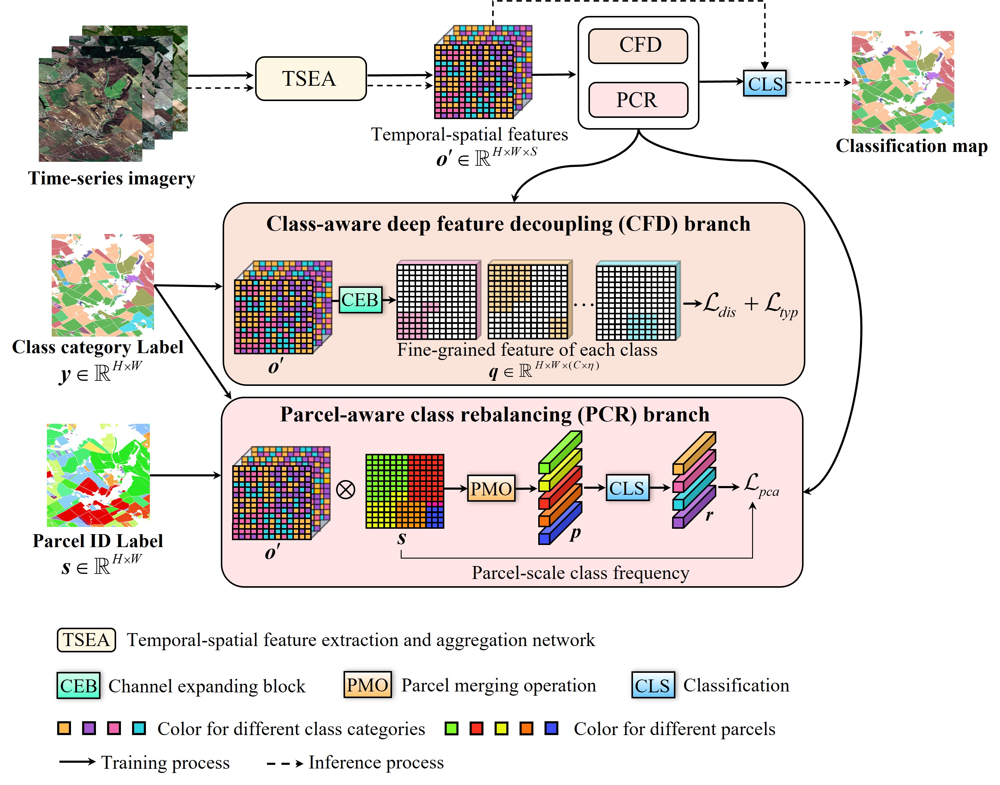

# FineCrop
<h3 align="center">FineCrop: Mapping fine-grained crops using class-aware feature decoupling and parcel-aware class rebalancing with Sentinel-2 time series</h3>

<h5 align="right">by <a href="https://ll0912.github.io/">Lei Lei</a>, <a href="https://jszy.whu.edu.cn/WangXinyu/zh_CN/index.htm">Xinyu Wang </a>,  <a href="http://rsidea.whu.edu.cn/">Yanfei Zhong</a></h5>, <a href="http://www.lmars.whu.edu.cn/prof_web/zhangliangpei/rs/index.html">Liangpei Zhang</a>



This is an official implementation of FineCrop in our ISPRS 2025 paper <a href="https://authors.elsevier.com/c/1lbcd3I9x1uc1l">FineCrop: Mapping fine-grained crops using class-aware feature decoupling and parcel-aware class rebalancing with Sentinel-2 time series </a>. FineCrop is a framework for fine-grained crop classification. It is very flexible, which can be added to popular spatio-temporal network. 


## Citation
If you use FineCrop in your research, please cite the following paper:
```
@article{lei2025finecrop,
title={FineCrop: Mapping fine-grained crops using class-aware feature decoupling and parcel-aware class rebalancing with Sentinel-2 time series},
author={Lei, Lei and Wang, Xinyu and Zhong, Yanfei and Zhang, Liangpei},
journal={ISPRS Journal of Photogrammetry and Remote Sensing},
volume={228},
pages={785--803},
year={2025},
publisher={Elsevier}
}
```
## Introduction
FineCrop is developed on the python library SITS_cls autonamously built for time-series remote sensing classification. The main module in the loss fuction ChannelDevLoss(ChannelDevLoss.py) and ParcelRebalancedLDAM(LT_RRLoss.py).

## Getting started
1. modify the config according to the dataset.

2. Training the model
```bash
python tools/train.py
```
The author sincerely thanks <a href="https://github.com/Hengwei-Zhao96">Hengwei Zhao</a> for the construction of SITS_cls library, which is inspired by <a href="https://github.com/Hengwei-Zhao96/HOneCls">HOneCls</a>.

